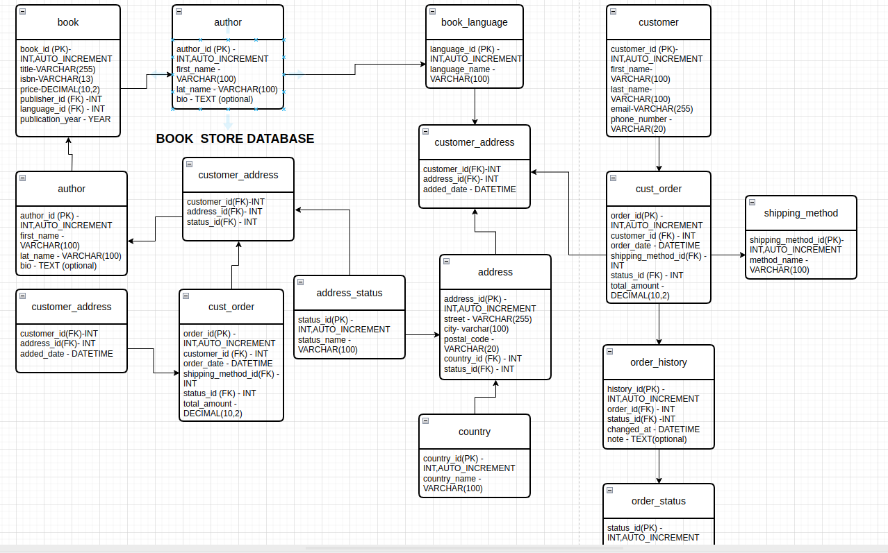

# 📚 Bookstore Database – Group Project

This project focuses on designing and implementing a relational **Bookstore Database** using MySQL. The goal is to simulate real-world operations of a bookstore, including handling book inventory, authorship, customers, orders, and role-based user access.

---

## 🧱 Step 1 – Schema and Table Creation

We designed the core schema and created tables to represent essential entities in a bookstore. These include:

- `BOOKS`
- `AUTHORS`
- `PUBLISHERS`
- `CUSTOMERS`
- `ORDERS`
- `ORDER_ITEMS`
- `ADDRESSES`

Each table was created with relevant primary keys, foreign keys, and data integrity constraints. Data was then inserted to reflect realistic bookstore operations.

---

## 🔐 Step 2 – User Groups and Roles

To manage user access and permissions, we implemented a **role-based user system**.

- Created a `ROLES` table to define user types (Admin, Customer, Staff)
- Created a `USERS` table with references to roles
- Sample user credentials were inserted
- (Optional) Provision for permission management using a `PERMISSIONS` table and role-permission mapping

This setup helps simulate real-world user access control and supports future scalability in web applications.

---

## 🧪 Step 3 – Testing Functionality

We tested various SQL queries to verify that:

- Customers can place orders for books
- Admins/staff can view, manage, or edit inventory
- User roles properly restrict or allow access
- Joins between entities like books/authors/orders work seamlessly
- Data integrity is maintained across foreign key relationships

---

## 🗺️ Database Schema Diagram

### 🖼️ Diagram Screenshot

### 🔗 View Full Diagram on Draw.io / Google Drive

[📎 Click here to view the full diagram](https://drive.google.com/file/d/1B9q3W8ICvSuUHInEgQ3ve9nESVg2pHat/view)

---

## 👥 Contributors

- **Comfort Ndungu**
- **Timothy Kibunja**
- **Keath Morgan**

---

## 💡 Future Improvements

- Add full authentication system with hashed passwords
- Extend role permissions (e.g., can_edit_books, can_delete_orders)
- Create a front-end dashboard for real-time interaction
- Integrate payment gateway simulation for realistic checkout

---

## 📌 Notes

- Ensure MySQL is running and accessible during testing.
- Use MySQL Workbench or command-line tools for interaction.
- All queries and sample data are stored in the `sql-scripts` folder (if applicable).

---
